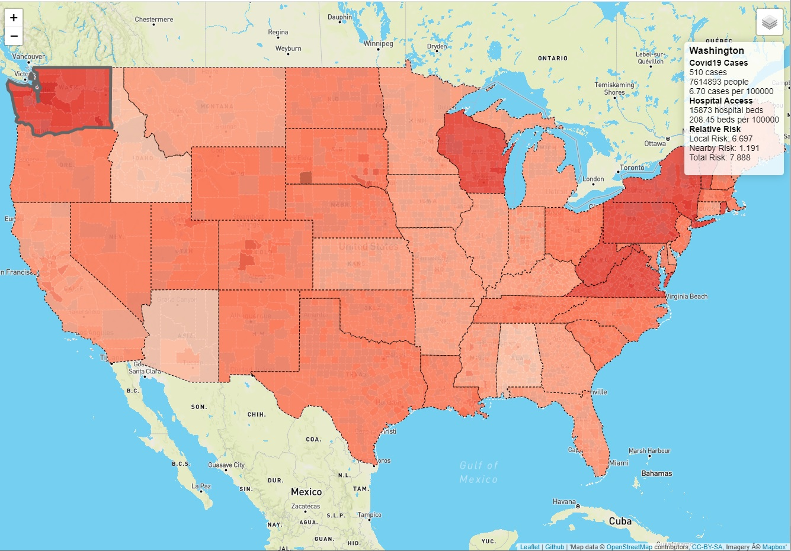

# Covid19 Comparison - View at <a href="https://covidcompare.com" target="_blank">CovidCompare.com</a>

Visualizing the spread and relative risk of Covid19 at the local level.

## Why?

Almost all the Covid19 maps I've seen show just the *absolute* number of cases in a location, but that's not the most important metric. 50 cases in Kentucky isn't the same as 50 cases in NYC. 

We pull in data on population, hospital beds, and neighboring counties/states to show the *relative* risk level so that people can better understand what their community is up against. 

[](images/states.jpg)

[](images/counties.jpg)

## How to Run This Project
- This project depends on an api key from Mapbox. [Generate one here.](https://docs.mapbox.com/help/how-mapbox-works/access-tokens/)
- Add a config.js file to the root of the project directory and add the following:

```
let API_KEY_MAPBOX = '<yourMapboxApiKey>'
```
- Open index.html in the browser of your choice to begin comparing Covid19 at the state and county level.

## Data

All of our data is open-source and free to use. The US does not have a good centralized data source for county level infections, or testing data, but we are working on an API to serve it up for other applications.

For county level data a big thanks to [David Zemel](https://www.github.com/dzemel), [Sam King](https://www.github.com/SamSamDataMan), and [Steve Schmidt](https://www.youtube.com/watch?v=yoYZf-lBF_U) for manually sourcing it from state health department and media websites.

For testing data we owe the [Covid19 tracking team](https://covidtracking.com/about-team/) for their great work and commitment to open-sourcing data during a public health crisis.

#### Map Data 
- [GeoJSON, SHP, and KML files for US States and Counties](https://eric.clst.org/tech/usgeojson/)
  - Credit to Eric Celeste for creating this page

#### Covid19 Data
- [State Infection and Testing Data](https://covidtracking.com/) and their [Crowdsourced Spreadsheet](https://docs.google.com/spreadsheets/u/2/d/e/2PACX-1vRwAqp96T9sYYq2-i7Tj0pvTf6XVHjDSMIKBdZHXiCGGdNC0ypEU9NbngS8mxea55JuCFuua1MUeOj5/pubhtml)
- County Level Data - [CSV](https://github.com/rbracco/covidcompare/blob/master/data/dataCovidCounty.csv) and [javascript](https://github.com/rbracco/covidcompare/blob/master/data/dataCovidCounty.js)

#### Population Data
- County Level - [Census estimated population for 2018 (Direct Download)](https://www2.census.gov/programs-surveys/popest/datasets/2010-2018/counties/totals/co-est2018-alldata.csv)
- County Level - [Census estimated population for 2018 (Website)](https://www.census.gov/data/datasets/time-series/demo/popest/2010s-counties-total.html#par_textimage_70769902)
- State Level - 

#### Hospital Data
- [HIFLD Hospital Dataset](https://hifld-geoplatform.opendata.arcgis.com/datasets/hospitals) - Taken and cleaned as they use "-999" beds to represent NaN. 

## Contribute

We are looking for contributors of all skill levels. CovidCompare is built with javascript and vanilla js, with a bit of data massaging using Python. 

We are in need of 
- Data scientists who can help us improve our algorithm (it's very poor right now while we're prototyping).
- [Leaflet.js](https://leafletjs.com/) and arcgis/qgis rockstars who can help make our display more useful
- Data collectors (no coding needed!) to help us find more local data on Covid19 transmission
- Much more, this is a fast moving project launched on 3/10/2020.

#### Current Contributors
- [David Zemel](https://www.github.com/dzemel)
- [Kate Eldridge](https://www.github.com/keldri)
- [Robert Bracco](https://www.github.com/rbracco)
- [Sam King](https://www.github.com/SamSamDataMan)
- [Steve Schmidt](https://www.youtube.com/watch?v=yoYZf-lBF_U)
